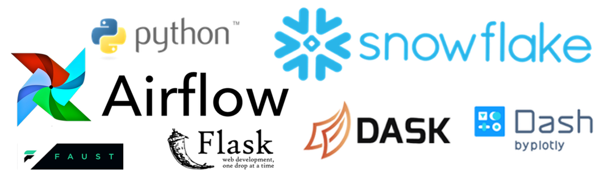
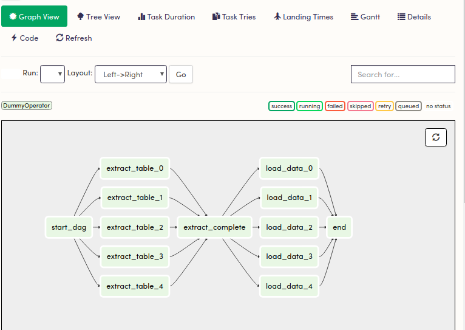
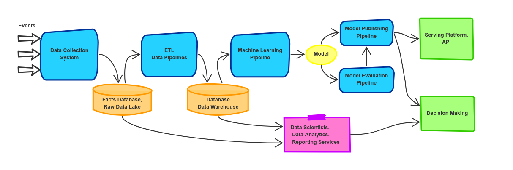

# Weapons of choice to build lean data systems in Python

Created: Jan 15, 2019 3:02 PM

Being [data-driven or data informed](https://hackernoon.com/why-you-should-be-data-informed-and-not-data-driven-76079d187989) is seen as a competitive advantage or even crucial foundation for companies that want to survive and thrive in the modern business environment. 

It is true for both small businesses and startups. Most of them want to benefit from the information they have. Their needs can vary: dashboards for marketing people, reports and analytics to make informed decisions, tapping into Machine Learning to augment existing products.

We should approach building data systems the same way we build software products in general nowadays - being flexible, nimble, lean, moving forward in small iterations with constant feedback and corrections. 

What does "lean" mean? To have a lean mindset is to focus on delivering value to customers fast with less resources. It's an approach, a philosophy to run a company, build a technical vision, choose technologies. 

In our case I'd like to suggest the three principles:

- Minimize time on operational and maintenance work. Pick tools that are easier to set up and maintain, prefer using third-party hosted tools (SaaS).
- Be pragmatic deciding on frameworks and libraries: do not choose new shiny unstable tools, do not build your own frameworks, if they are not your core competence, do not choose prematurely large complex software, better focus on your needs and requirements for the current year. Do not pick Hadoop if Airflow can deal well with processing your data.
- Try to choose tools that are easier to learn, integrated with each other, written in the same language. This gives you and other engineers flexibility to quickly switch to a priority work without wasting time learning another language. 

In the article I want to introduce a number of tools, Python focused. I believe they can help to iteratively grow data pipeline in the context of small companies, where there is often a single data engineer or scientist. Those tools are

- [Airflow](https://airflow.apache.org/) for building data pipelines,
- [Dask](https://github.com/dask/dask) parallel computing,
- [Dash](https://plot.ly/products/dash/) for analytical web applications, dashboards, and
- [Snowflake](https://www.snowflake.com/) as a data warehouse.

Not each of them is required for a particular company. The idea is that they cover the areas typically important in everyday work of data scientists. I'd like you to know that I am not tryting to make your believe this approach and tools are the single best way. My goal is rather to present you with reasonable options to build data systems with modern solid Python tool set.

In the article, I'll try to elaborate how each of those pieces matches the idea of focusing on fast value delivery while minimizing operational costs.

## Structure and Schedule

Let's start with the ETL the process of retrieving data from different sources, transforming them to clean, change their format, and extract interesting information, and finally persisting results in a storage.

The simplest scenario we can see at companies is that there is the main source of data (an SQL database or other sources like Google analytics, external services), and the management asks for weekly sales reports.

 The simplest way to meet that request is to setup a service that queries data from those sources, from the main database, transforms, stores, builds a report, and sends it on ascheduled basis to the management. The service can be scheduled with modern cron-like software, for example, [CronJob](https://kubernetes.io/docs/concepts/workloads/controllers/cron-jobs/) or [Nomad](https://www.nomadproject.io/).

Later, there will be more reports, more dashboards. More complexity comes with it: jobs will have many steps, depend on each other, they will fail, the engineers need to restart them. All in all, a nightmare to touch.

You need a tool that will ease the pain in:

- handling task dependencies,
- scheduling,
- doing retries,
- monitoring,
- scaling.

### Here, the Apache Airflow enters the stage. 

This tool allows to define tasks programmatically, schedule them, set dependencies between them, retry strategies. It also provides UI and monitoring tools.

The initial setup is not easy, and the tool has some learning curve. The feedback I received is that it can take weeks for a single data scientist to set it up properly and start getting familiar with it.  Especially, when they have to switch to other tasks. Nevertheless, usually, the result is worth the initial investments. 

Airflow supports the functionality mentioned above. Tasks, task dependencies, and workflows, represented as Directed Acyclic Graphs (DAGs) are defined programmatically in Python. This feature allows more powerful and flexible pipelines, dynamic workflows and variables if we compare it to declaring pipelines with XML or YAML.

An Example of Airflow's DAG:

You can use Airflow for a variety of tasks: building ETLs, triggering jobs, computation tasks. The framework scales well and is maintenance-friendly, since pipelines are defined in code and can be put in source control system.

###A few drawbacks of Airflow:

- Setup is not easy, but it depends on the experience of engineers,
- There is a learning curve,
- A few people mention that there are a lot of bug in Airflow. Definitely, it was the case one-two years ago, but the situation has drastically improved since then.

The project is properly documented and there's a large community around it.

## Store and Retrieve

The company can start with using their current SQL storage as a source for analytical queries. Do not run queries against your primary database for  performance and security reasons. Use replicas, or regular backups of your database for analytical work.

This may be enough to start, but soon you may face problems with using the database built for low latency operations and transactions as a data warehouse. They also lack functionality such as user-defined functions, and show low performance for complex analytical queries.

There is a number of options available: Redshift on AWS, BigQuery on Google Cloud are good candidates. I want to suggest you Snowflake, a SQL data warehouse-as-a-service.

As it is a data warehouse not an OLTP (online transaction processing) database like MariaDb or Postgres, it will be much more efficient for analytical queries over a growing amount of data. Moreover, Snowflake allows you to define user defined functions written in Python.

In my experience, the more data you have, the more beneficial cost-wise Snowflake is compared to Redshift (which is notoriously expensive).

A very important benefit for a small company that focuses on speed of delivery (and also doesn't not have a whole team of data engineers or devops) is that Snowflake is a service. This way your team doesn't need to manage infrastructure, database availability, and scaling.

## Visualize and Interact

Different departments at the company want to understand data, see the trends. Data visualization is the key aspect of turning statistical numbers into actions.Therefore, data scientists must be ready to build dashboards and charts. 

Static graphs are a good start, but you may want or need to make more interactive dynamic graphs. Great [dynamic visualisation](https://vimeo.com/66085662) can be an important thinking tool, and is both [art and science](https://www.edwardtufte.com/tufte/books_vdqi). 

### [Dash](https://plot.ly/products/dash/) and [Bokeh](https://bokeh.pydata.org/en/latest/) are two Python alternatives for building interactive analytical dashboards. 

Dash is based on Plotly, and it makes it flexible and powerful. In addition, Dash is powered by very popular React.js on the front end, therefore it is easy to extend with new components. Data scientists can define HTML with Python, utilize markdown. 

Dash provides functionality to make interactive applications, embraces reactive programming (being reactive is [considered great](https://medium.com/data-engineering/reactive-machine-learning-3035b83d18e9) nowadays) so it can update the chart based on user input, moving sliders, etc. 

Dash uses Flask framework under the hood, therefore it is deployed as a web application. Plotly, the company behind Dash, also offers Dash Deployment Server, a commercial product for deploying Dash apps on popular cloud providers, and this may remove some operational work from your engineers.

## Go Parallel and Compute

There can come a moment where data scientists find it slow and inefficient to do their computations on a single machine. 

First of all, a piece of good advice: if you can stay on a single machine, you'd better stick with it. Maybe, by beefing up the machine or improving your workflow, etc. Building a cluster of machines and introducing a framework to rule them all add to your work tasks, shift the focus of data people from domain problems to maintenance and operations.

There are solid frameworks (like Hadoop or Apache Spark) that your company can start adopting, but note that it may be not feasible for your small team to setup and operate these large and powerful frameworks. 

### You need a framework that fits between the big frameworks and running code on a single machine. 

Also, those tools usually mean that data scientists need to completely rewrite scripts they used to run on their machines into other languages or libraries. 

Therefore, it would also be convenient to have a tool that allows you to stay in Python ecosystem, scale Numpy, Pandas, or Scikit-Learn, while requiring a minimum amount of rewriting to run scripts in parallel on a cluster of machines. Those are the possibilities that Dask provides. 

Dask offers the dashboards to monitor provide current progress, resources consumption, there's also a profiler to learn what lines of code take more time to compute.

What about the deep learning? I am not sure if it's feasible and I haven't tried it yet, but there are ways to run [Tensorflow](http://matthewrocklin.com/blog/work/2017/02/11/dask-tensorflow) and PyTorch on Dask. There was [discussion](https://github.com/dask/dask-ml/issues/281) about using Dask for deep learning tasks. 

Personally, my first choice of tools that empower my deep learning work while staying within [Jupyter notebook](https://jupyter.org/) (and not dealing with setting up on AWS!) would be services like [Paperspace](https://www.paperspace.com/) or [Floydhub](https://www.floydhub.com/).

You can also integrate Airflow and Dask by using DaskExecutor that helps to run Airflow tasks on a Dask cluster. 

## Python... it's everywhere!

Besides the fact that Python is a top language for data science, it has rich and stable ecosystem to build APIs, web applications, parsers, utilities. 

It's pragmatic for small companies to stick with fewer languages, more homogeneous environment to focus on building and delivering value rather than managing different environments and struggling with setting up, fixing, and operating tools. 

Let's look at a well-established data system with model deployment pipeline and find the parts our stack can be used.

**Data Collection System** - this can include HTTP clients, other databases, queue systems. If you want to stay within Python ecosystem it may be pretty comfortable and you'll find a lot of options to pick from, f.e. Flask for APIs, SQLAlchemy  for database access. 

If you have a data streaming component before embracing the power of Apache Flink, Spark Streaming etc. you may have a look at [Faust](https://faust.readthedocs.io/en/latest/). 

The latter uses asyncio module for high-performance asynchronous I/O. Faust is used at the company Robinhood to build high performance distributed systems and real-time data pipelines that process billions of events every day.  Data Collection System is the first place where you may start using DAGs and scheduling, therefore it's an obvious candidate to use Airflow. 

**Model Learning Pipeline**, **Model Evaluation Pipeline**, and **Model Publishing Pipeline** are other places to utilise Apache Airflow. 

**Raw Data Lake** that is used for storing unprocessed events from the data sources and **Data Warehouse** where transformed data is stored for reporting, BI, and data science work are the components where Snowflake can certainly be used. Later, the company can switch to using distributed file systems like S3, HTFS for Raw Data Storage.

**Serving Platform** is the services you use to serve your model, provide access to data, potentially with  [materialized views pattern](https://docs.microsoft.com/en-us/azure/architecture/patterns/materialized-view). You stick here with Flask, Django, Pyramid, etc.

As you can see, data team can effectively stay within Python environment, and build effient lean data systems. In latest Python versions there's a functionality that can improve clarity and maintenance of code as well. Just have a look at [typing module](https://docs.python.org/3/library/typing.html) and [data classes](https://docs.python.org/3/library/dataclasses.html).

Happy Exploring and Merry Hacking!